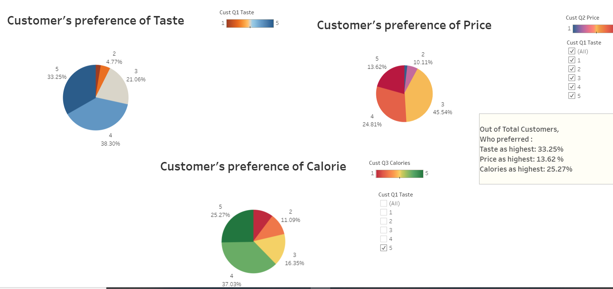
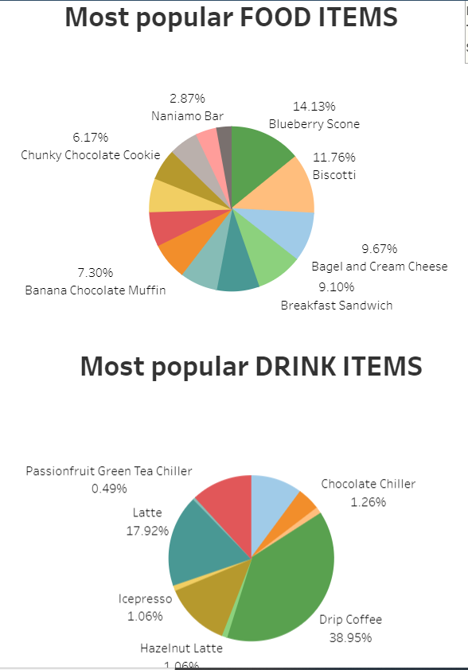
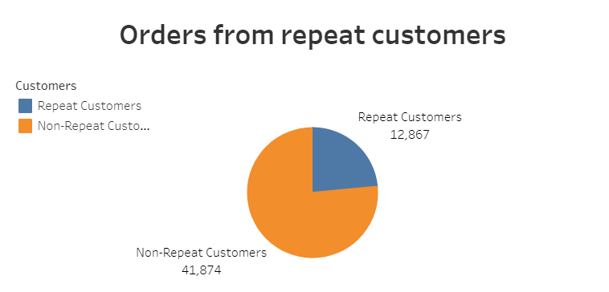
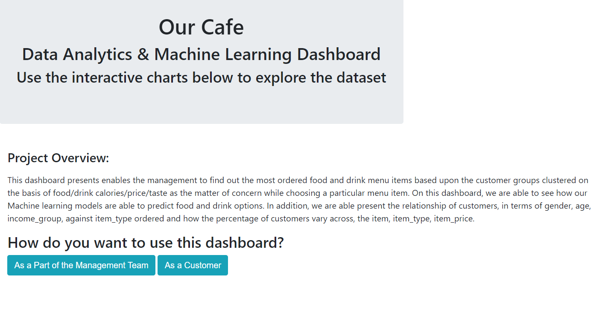
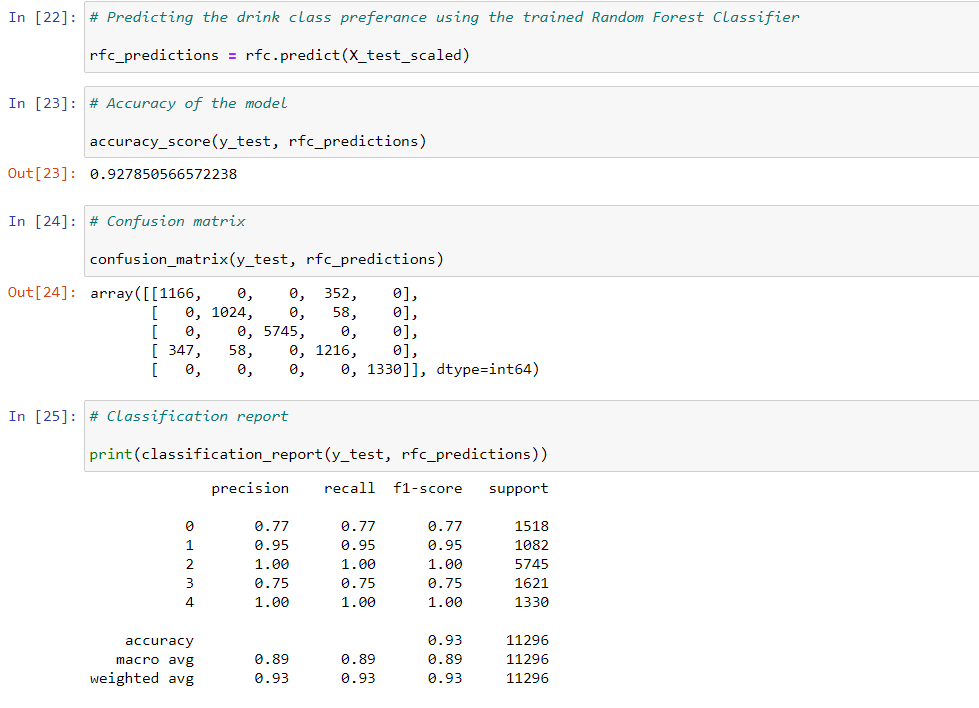
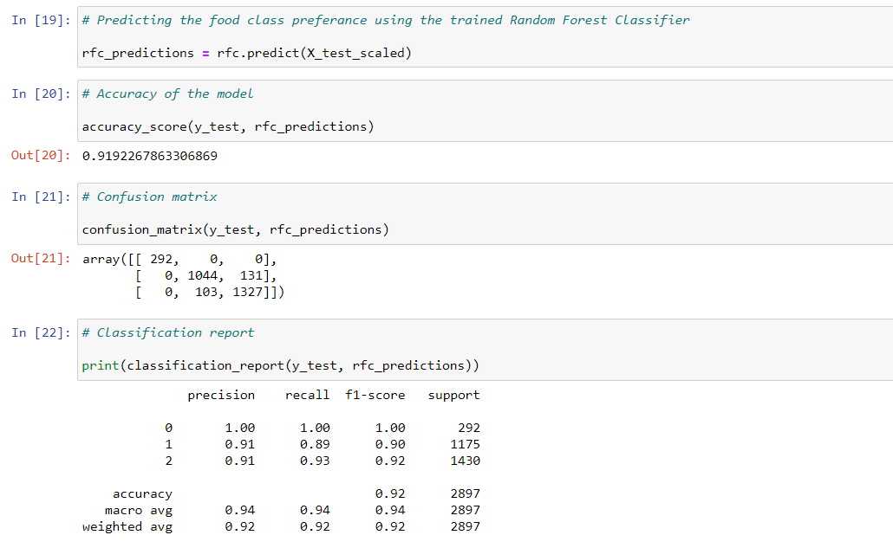
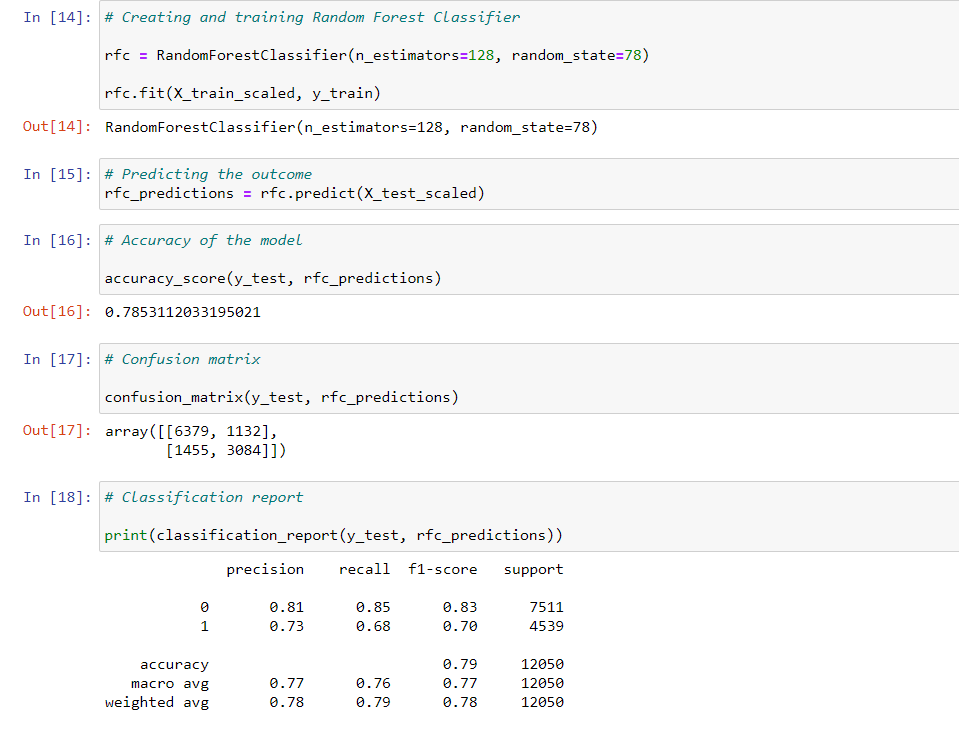

# **Cafe Chain Analysis- Team 5 (Ehsan, Kirti, Salman, Samiul)**

## **Selection of Topic**
This is the analysis of a *Cafe chain* business which wants to understand its customers.

## **Reason Why We Selected This Topic**

Understanding of the customer base is one of the most important aspects of any business and same is true for a retail chain running coffee shops across the country. If the management has deep understanding of its business, they can take correct decisions to expand their business and make it profitable. The major reasons why we selected this data are:

	* Real Life Example​

	* Large Scale Business​

	* Can be used for Machine Learning​

	* Helpful for Data Visualizations​

	* Data driven decision making in business​

	* Understanding the Core Customer​

## **Description of The Data**

This is a real-life data collected by the management of "Our Cafe"" (Not the actual name for confidentiality reasons)- a  cafe chain business running their outlets across the country. It contains transaction‐level data from eight "Our Cafe" locations in a recent year. For each
store, we have a random sample of daily transactions for 10 randomly selected days of each month. Each
observation in the data represents a transaction and includes information on the specific items purchased
and the prices and caloric content of those items. The data are limited to transactions that involve at
most one drink and one food item—the vast majority of all transactions fall into this category. In addition,
there is information about the demographic characteristics of the customer as well as the customer’s
responses to three survey questions. Finally, there are variables that indicate whether "Our Cafe"
location at which the transaction took place competes directly with a *medium size retail chain*, a *big retail chain*
and an independent coffee shop. The precise variable definitions are below:

**Variable** 	    **Definition**

Cust_ID 	        A unique customer identifier

Store_ID 	        A unique store identifier

Transaction 	    A unique transaction identifier

Day 		        The day of the month on which the transaction took place

Month               The month in which the transaction took place

Food 		        A dummy variable that equals 1 if the transaction involved a food purchase

Drink 		        A dummy variable that equals 1 if the transaction involved a drink purchase

Drink_Type 	        The specific type of drink purchased (e.g.: Latte, Cappuccino, Drip Coffee, etc...                    )The variable is missing for transactions that did not involve a drink purchase.

Drink_Size 	        The size of drink purchased (small, medium, large). The variable is missing for
		            transactions that did not involve a drink purchase.

Drink_Milk 	        The type of milk in the drink if applicable (skim, 2%). The variable is missing for
                    drink types	that cannot customize the milk when ordered and for transactions
		            that did not involve a drink purchase.

Drink_Price 	    The price paid for the drink. The variable is missing for transactions that did not
		            involve a drink purchase.

Drink_Calories      The number of calories in the drink. The variable is missing for transactions that
		            did not involve a drink purchase.

Food_Type 	        The specific type of food item purchased (e.g.: . The variable is missing for
		            transactions that did not involve a food purchase.

Food_Price 	        The price paid for the food item. The variable is missing for transactions that did
		            not involve a food purchase.

Food_Calories 	    The number of calories in the food item. The variable is missing for transactions
		            that did not involve a food purchase.

Total_Spend 	    The total amount paid for the items purchased

Cust_Gender 	    The customer’s gender: 0 indicates female; 1 indicates male

Cust_Age 	        The customer’s age in years

Cust_Income 	    The customer’s annual income

Ans_q1_Taste 	    The customer’s stated answer to the following question: On a scale of 1 to 5,
		            how important is taste when you choose what items to purchase? `1’ indicates
		            “not important” and `5’ indicates “very important”.

Ans_q2_Price 	    The customer’s stated answer to the following question: On a scale of 1 to 5,
		            how important is price when you choose what items to purchase? `1’ indicates
		            “not important” and `5’ indicates “very important”.

Ans_q3_Calories     The customer’s stated answer to the following question: On a scale of 1 to 5,
		            how important is caloric content when you choose what items to purchase? `1’
		            indicates “not important” and `5’ indicates “very important”.

Comp_med 	        A dummy variable that equals 1 if the store is within 0.5 km of a medium competitor

Comp_big	        A dummy variable that equals 1 if the store is within 0.5 km of a big competitor
		            store

Comp_Indep 	        A dummy variable that equals 1 if the store is within 0.5 km of an independent
		            coffeehouse (single store owner)

## **Questions We Hope To Answer**

There are many pertinent business questions we want to address and hope that we will be able to answer them. Currently we have addressed following question:

	* Popular Food / Drink Items  & Demand over the year​

	* Identification of Customer Preferences (Taste/Price/  Calorie)​

	* Customer Demographics​

	* Core Customer of “Our Café”​

	* Customer Spending Habits​

	* Repeat Customers & Store Wise Distribution​

	* Highest Revenue Stores​

	* Reliability of Survey Answers & Actual Purchases​
    
## **Communication Protocol in the Team**

There is a robust communication protocol among the team members. We have already established the slack group and continuously share ideas about the project and the issues faced by any member and take help from our assigned TA. We also schdeule zoom meetings on need basis outside the office hours.

## **Dashboard Preparation**
We are using *Tableau* for our visualizations and an interactive *Web Application* (using Flask, HTML, Java) to display the options to the Cafe management and the customers.

## **Database Formation**
The project data has been stored in "SQLAlchemy" and being queried using PGAdmin and Flask.

## **WORK IN PROGRESS (As of April 4)**

### **Presentation**
The link of the presentation [can be reached here](https://1drv.ms/p/s!AkVDqlS3Ei2agpoFMxa9sUqR1cCPLA?e=dIhtIA)

### **Data Exploration**
In this phase, we are working on following:

	* Data visualizations​
	* Customer Demographics data​
	* Stores and their order variations​
	* Food and drink items​
	* Store Performance​
	* Repeat Customers & trends​
	* Data set division as per machine learning model 		 requirement​

Here are few iamges of Data exploration at this stage:
### *Customer Responses*
</img>
### *Popular Food/Drink Across All Shops*
</img>
### *Repeat Customer Orders*
</img>

### **Web Application**
We are developing an interactive Web Application to help Management of the Cafe chain to identify a repeat customer. A glimpse of this app is as below:
</img>

### **Machine Learning Model**
We are analyzing the dataset with different machine learning models to predict the following:​​

	* Recommending Food/Drink Items as per their    		 Demographics and Preferences​

	* Identifying/Predicting the Regular Customer​

The code snippet showing accuracy scores of these models are as below:

### *Drink Recommendation*
</img>

### *Food Recommendation*

</img>

### *Identifying Repeat Customer*
</img>
